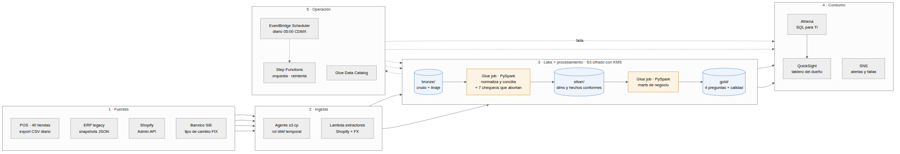

# Propuesta técnica — Plataforma de datos CaféNorte

**Para:** Dirección General y Dirección de TI, CaféNorte
**De:** Tuxpas — AWS Advanced Partner
**Fecha:** agosto 2026 · **Vigencia de la estimación:** 30 días

---

## El problema, en una frase

Cada área reporta un número distinto porque cada sistema define "venta" de forma
distinta. No es un problema de reportes: es que **no existe un lugar donde la
definición viva una sola vez**. La prueba de concepto que acompaña esta propuesta
ya lo demuestra con los datos que nos compartieron: sumar la columna de importes
del POS tal cual sobreestima el ingreso **9.1%**, porque mezcla notas de crédito,
complementos de pago, traslados de mercancía y hasta renglones de nómina. Y hay
**tres productos que se venden por debajo de su costo en las 40 tiendas**, con una
pérdida de **$199,594 MXN en doce meses** que hoy nadie ve.

Lo que proponemos es un lugar único donde esas reglas estén escritas, probadas y
sean auditables.

---

## Arquitectura propuesta

**Ingesta.** Cada fuente entra a un bucket de S3 con su formato original:
el POS y el ERP suben su export nocturno con un agente `aws s3 cp` autenticado
con rol IAM temporal (sin llaves permanentes en las tiendas); Shopify y el tipo
de cambio de Banxico los baja una función Lambda diaria. *Se descartó AWS
Transfer Family SFTP: cuesta ~$216/mes sólo por estar encendido, más que todo el
resto de la plataforma junta.*

**Procesamiento.** Dos jobs de **AWS Glue 4.0 (PySpark)** aplican las capas
bronze → silver → gold. Es literalmente el mismo código de la prueba de
concepto: cambian la creación de la sesión y las rutas a `s3://`. **Step
Functions** los orquesta con reintentos y avisa por SNS si algo falla. Los siete
chequeos de calidad corren dentro del job y **abortan la corrida** en vez de
publicar números malos — es la diferencia entre "el tablero está caído" y "el
tablero miente", y la primera es mucho menos cara.

**Consumo.** **Athena** para que TI consulte con SQL estándar sobre los mismos
datos que ve el tablero, y **QuickSight** para la dirección. Alertas por SNS
cuando un SKU se queda en cero más de N días o cuando un producto cruza a margen
negativo.

**Lo que deliberadamente no proponemos:** Redshift, EMR o Kinesis. Con el volumen
de CaféNorte (~1.5 millones de renglones al año) cualquiera de los tres consume
el presupuesto completo sin dar un solo número que Athena no dé. Si en tres años
el volumen cambia de orden de magnitud, la migración a Redshift Serverless es
incremental porque los datos ya están en Parquet particionado.

---

## Costo mensual estimado

Región `us-east-1`, año 1, en USD. Supuestos: una corrida diaria, ~25 GB
promedio de almacenamiento acumulado, 2 autores y 8 lectores de tablero.

| Servicio | Supuesto | USD/mes |
|---|---|---:|
| Amazon S3 (Standard + IA a 90 días) | 25 GB + ~250k operaciones | 1.80 |
| AWS Glue ETL | 2 DPU × 12 min diarios + 1 reproceso semanal | 7.00 |
| AWS Glue Data Catalog | < 1M objetos (capa gratuita) | 0.00 |
| AWS Lambda + EventBridge Scheduler | 60 ejecuciones/mes | 0.10 |
| AWS Step Functions | 30 ejecuciones × ~15 transiciones | 0.02 |
| Amazon Athena | ~1,200 consultas, ~60 GB escaneados | 0.30 |
| **Amazon QuickSight** | **2 autores ($24 c/u) + 8 lectores ($3 c/u)** | **72.00** |
| Secrets Manager + KMS | 2 secretos, 1 llave | 1.90 |
| Amazon CloudWatch | logs y alarmas | 2.00 |
| | **Total** | **≈ $85** |

**Queda 57% de holgura sobre los $200 acordados.** Triplicar el volumen mueve el
total a ~$100: el cómputo y el almacenamiento son la parte barata.

**El costo escala con usuarios, no con datos.** QuickSight es el 85% de la
factura. Si mañana quieren que los 40 gerentes de tienda vean el tablero, son
+$120/mes y el presupuesto se aprieta. Vale la pena decidir desde ahora quién
consume y cómo: un correo diario con el PDF del tablero cuesta cero y puede
cubrir al 80% de esa audiencia.

---

## Plan de implementación

| Fase | Duración | Entregable | Cómo sabemos que salió bien |
|---|---|---|---|
| **0 · Definiciones** | 1 semana | Documento firmado de definiciones (qué es una venta, qué es un quiebre, qué entra al costo) | Finanzas y Operaciones firman el mismo documento |
| **1 · Fundación** | Semanas 1–3 | Landing en S3, Glue bronze/silver, catálogo, Athena, las 4 preguntas, chequeos de calidad | TI consulta un número y coincide con el sistema origen |
| **2 · Consumo** | Semanas 4–6 | QuickSight con 3 vistas (ventas, inventario, margen), alertas de quiebre y de margen negativo, automatización diaria | La dirección abre el tablero sin pedírselo a nadie |
| **3 · Endurecimiento** | Semanas 7–10 | Carga incremental, histórico completo, pruebas de regresión, monitoreo de costos, runbook y capacitación | TI de CaféNorte corre un reproceso sin nosotros |

**La Fase 0 no es relleno.** Es la fase que decide si el proyecto sirve. Mientras
Finanzas y Operaciones no estén de acuerdo en si una nota de crédito resta del
mes en que se emitió o del mes de la venta original, cualquier tablero que
construyamos va a estar mal para alguno de los dos.

---

## Riesgos

1. **El maestro de producto del ERP está incompleto.** Cinco SKUs con ventas no
   existen en la tabla de mapeo, incluido uno de los tres productos que pierden
   dinero. Lo resolvimos con una llave derivada del consecutivo numérico que
   comparten los tres sistemas, validada contra el mapeo oficial, pero **es una
   muleta**: si alguien da de alta un producto sin seguir la convención, se
   rompe. *Mitigación:* el pipeline se detiene en vez de callar; la solución de
   fondo es gobernar el catálogo en el ERP (Fase 3).
2. **Dependemos del catálogo de comprobantes del POS.** Si el proveedor del POS
   agrega un tipo nuevo sin avisar, el ingreso se rompe silenciosamente.
   *Mitigación:* contrato de datos con el proveedor y un chequeo que falla ante
   un tipo desconocido.
3. **El ERP entrega fotos, no movimientos.** Su propia metadata lo dice: "no
   incluye movimientos transaccionales". Sin entradas y salidas no se puede
   medir merma, ni reconstruir el inventario de una fecha pasada, ni calcular
   rotación con precisión contable. *Mitigación:* pedir la extracción de
   movimientos en la Fase 0; si no existe, el alcance de inventario se queda en
   disponibilidad y quiebres.
4. **Datos personales en Shopify.** Las órdenes traen nombre, correo, RFC y
   domicilio: son datos personales bajo la LFPDPPP. En la prueba de concepto los
   descartamos en la ingesta porque no hacen falta para ninguna de las cuatro
   preguntas. Si CRM los necesita, van a un bucket aparte con su propio cifrado,
   retención y control de acceso — no al lake analítico. *Decidir en Fase 0 si
   además hay requisito de residencia en México; la región `mx-central-1` existe,
   con ~15% de sobrecosto.*
5. **Una sola persona de TI del lado de CaféNorte.** Es el riesgo más común de
   que un proyecto así se apague seis meses después de entregado.
   *Mitigación:* runbook escrito y dos sesiones de capacitación en la Fase 3, con
   la corrida de un reproceso hecha por ustedes, no por nosotros.

---

## Preguntas que necesitamos responder antes de firmar

1. **¿Los montos del POS incluyen IVA?** Cambia todos los números de ingreso y
   margen. Hoy asumimos que sí (importe pagado por el cliente).
2. **¿Una nota de crédito resta del mes en que se emite o del mes de la venta
   original?** Hoy resta del mes en que se emite.
3. **¿El costo del ERP incluye flete y mermas, o es sólo precio de proveedor?**
   Si es lo segundo, el margen real es peor que el que reportamos.
4. **¿Qué es un quiebre para Operaciones: cero piezas en sistema, o por debajo
   del punto de reorden?** Hoy usamos cero piezas, que es el caso más tarde
   posible de detectar.
5. **¿Puede el ERP entregar movimientos de inventario y no sólo fotos diarias?**
6. **¿Los cinco SKUs sin mapeo son error de captura o productos descontinuados?**
7. **¿Cuántas personas van a consumir el tablero, y con qué frecuencia?** Es el
   85% del costo mensual.
8. **¿Basta con datos del día anterior a las 6 a.m., o hay decisiones que
   requieren información intradía?** La respuesta cambia la arquitectura, no sólo
   la configuración.
9. **¿Cuántos años de histórico deben conservarse, y hay requisito de residencia
   de los datos en México?**

---

*Anexo: la prueba de concepto —pipeline completo, 60 pruebas automatizadas y las
cuatro respuestas verificadas contra un cálculo independiente— está en el
repositorio que acompaña esta propuesta.*
